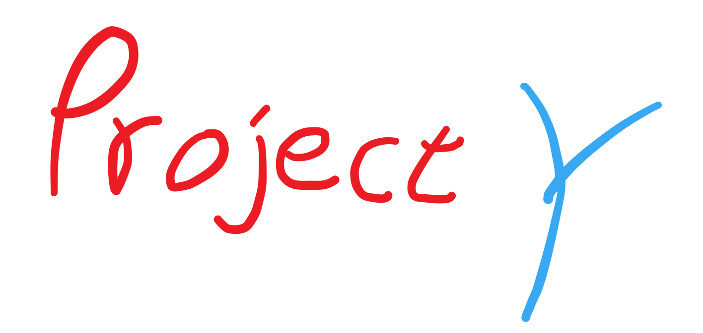

# Project Y

## What is Project Y

`Project Y` 是一系列不定期更新的课程，目的是带领同学们一起学习如何组织，开发，构架一个完整的应用程序。

这个计划的目的并不是去实际的想着某个既定目标去做出成果，仅仅只是想带大家体验或者说入门体验一个全栈开发的过程。

本计划的第一个课程，是关于如何写一个QQ机器人的课程。当然我们的主要目的不是去做一个QQ机器人，而是带大家去体验和学习这个开发的过程。

## What can I get from Project Y

在本计划中，你可能会学到

- 使用Python进行实际开发
- 使用Git的版本控制，自动化工作流
- 自动化部署，运维

## What should I know

当然，我们这个计划面向的是有一定基础的同学，你至少需要掌握以下技术或者具有以下条件

1. 能掌握一门语言的编写，最好是Python，但在开头我也会简单补充一下Python相关知识
2. 拥有一台自己的云主机，或者知道怎么购买云主机，至少1c2g的配置
3. 拥有一台Mac或者是Linux系统的电脑，因为Windows下配置实在是太麻烦了

当然，你需要做好以下的心理准备

1. 本人精力有限，可能有些问题需要你自己去探究
2. 讲课可能会带有一些自己的情感色彩，写代码也会有自己的喜好，你可以不认同并保持你自己的风格
3. 我可能不会咕咕咕，但也请想参与计划的大家也不要咕咕咕。

## Misc

- 该课程主要面向我的同学以及熟人，我并不想把这个课程的规模做的很大
- 有时可能我自己会出一些问题也请大家能够谅解的提供帮助
- 希望大家能够坚持下去

## Index

- [Pre Requirement](PREREQUIREMENT.MD)

